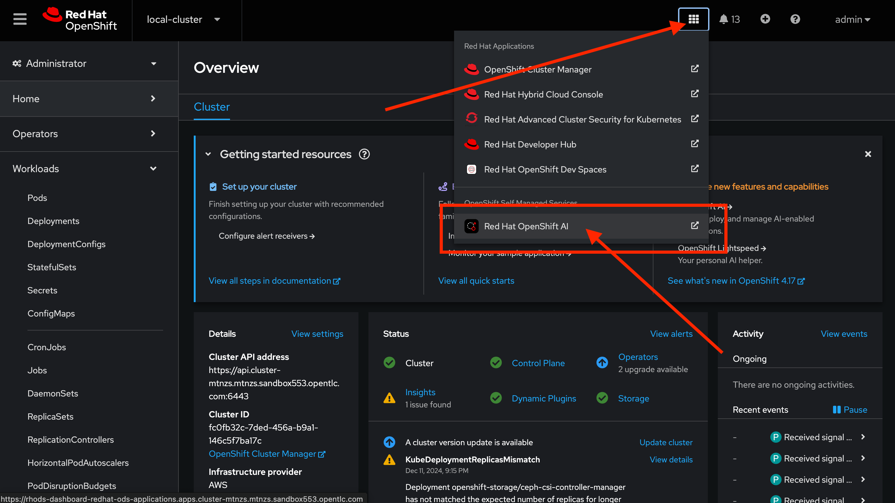
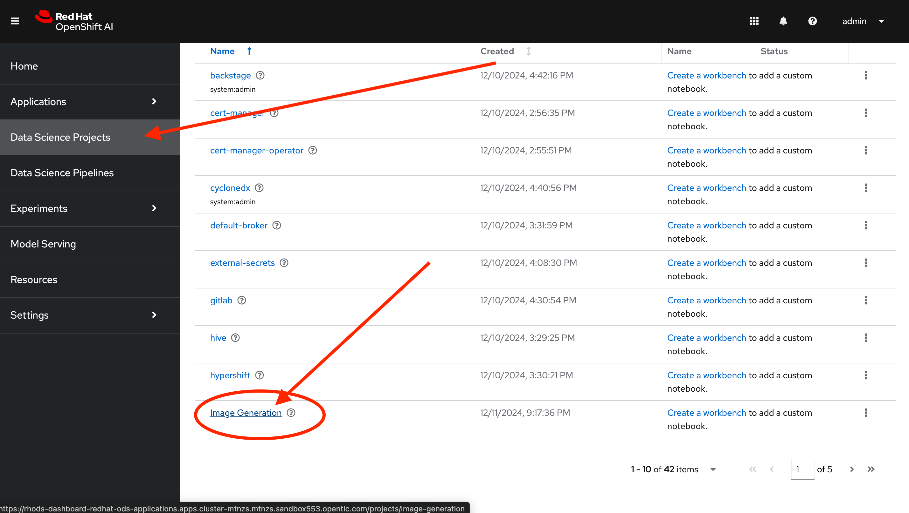
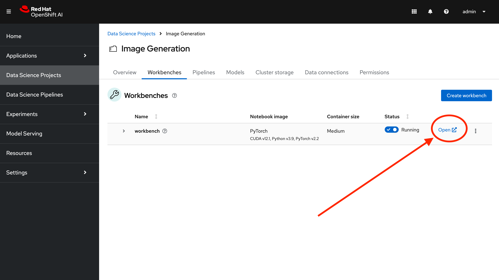
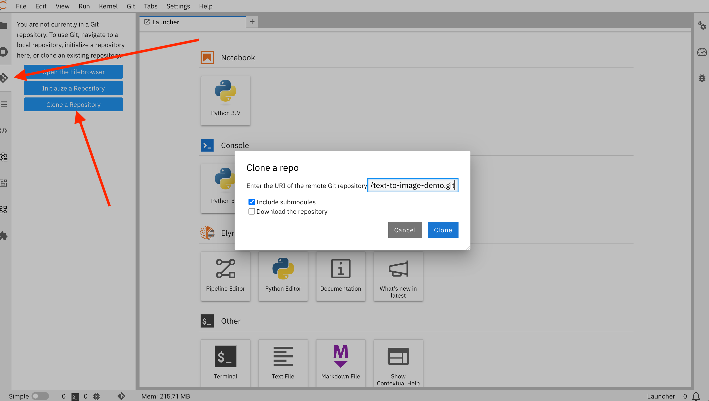

# Where is Teddy?

## Setup

This guide will help you to set up the Where is Teddy? Demo

### Prepare the Infrastructure

1. Order an OpenShift Cluster using the [TAP catalog item](https://demo.redhat.com/catalog?search=tap&item=babylon-catalog-prod%2Fenterprise.redhat-tap-demo.prod).

1. Tick the checkbox to enable RHOAI.

### Prepare the OpenShift AI Notebook environment

1. From the command line, login to OpenShift as a cluster administrator.

    > Use the data from the email you receive as part of the confirmation of the successful deployment of your environment.

1. Install the *Authorino* operator.

   ```sh
   oc apply -f ./setup/rhoai-config/subscription-authorino.yaml
   ```

1. Wait a few moments until the operator is fully installed.

1. Restart the data science operator pod.

   ```sh
   oc delete po -l name=rhods-operator -n redhat-ods-operator
   ```

1. Wait a few moments and check that the authorino pods are running correctly in the new `redhat-ods-applications-auth-provider` project. 

   > **If this is not working you won't be able to expose your model serving route externally from the console and will need to edit the service manually.**

1. Create the workspace `image-generation`.

   ```bash
   oc apply -f ./setup/image-gen/ds-project.yaml
   ```

1. Wait for project to be created.

1. Setup and configure Minio to enable the S3 storage.

   ```bash
   oc apply -n image-generation -f ./setup/image-gen/setup-s3.yaml
   ```

1. Wait for all the jobs to finish.

1. Create the serving runtime for the model serving.

   ```sh
   oc apply -n image-generation -f ./templates/serving-runtime.yaml
   ```

1. Create the storage for the workbench `workbench-storage`.

   ```bash
   oc apply -n image-generation -f ./setup/image-gen/pvc.yaml
   ```

   > Currently there is an issue with the storage provider in the GPU worker nodes that prevent the workbench to start, creating the persistent volume claim with [gp3-csi](https://console-openshift-console.apps.cluster-mtnzs.mtnzs.sandbox553.opentlc.com/k8s/cluster/storageclasses/gp3-csi) solves the issue.

### Create a new OpenShift AI Workbench:

1. Go to OpenShift AI (from the OpenShift console view, click on the applications menu in the top right, then select Red Hat OpenShift AI). 

    

1. Then Go to Data Science Projects. Select the "Image Generation" project.

    

1. In the overview tab, click on *Create workbench*.

    

1. From there, fill in the form with the following information: 

    **Name** `workbench`

    **Image selection** PyTorch

    **Version selection** 2024.1

    **Container size** Medium

    **Accelerator** NVIDIA GPU

    **Use existing persistent storage** `workbench-storage`

    **Use existing data connection** `My Storage`

1. Click on *Create workbench*.

1. Wait a few minutes until the status in the page is **Running**.

1. Open the newly created workbench by clicking *Open*.

    

1. In the new Jupyter notebook click on the *Git* tab and then the **Clone a Repository** button. Type in the following URI `https://github.com/cfchase/text-to-image-demo.git`. Finally click **Clone**.
    

### Run the notebook training

1. Run through the first 2 notebooks of the demo:

    - 1_experimentation.ipynb
    - 2_fine_tuning.ipynb

### Deploy the newly trained model 

1. Go back to the OpenShift AI console.

1. using the values from the notebook output and the registered serving runtime (use custom resources 1Gb 1 CPU)

1. Go to Red Hat Developer Hub. In the Catalog view,
      click "Create", "Register Existing Component" and add template from the following url:
      `https://github.com/redhat-developer-demos/where-is-teddy/blob/main/scaffolder-templates/wheres-teddy/template.yaml`

1. Register the API entity from the following url:
      `https://github.com/redhat-developer-demos/where-is-teddy/blob/main/genai-photo-generator-api/catalog-info.yaml`

1. Create a new component using the software template from Developer Hub
